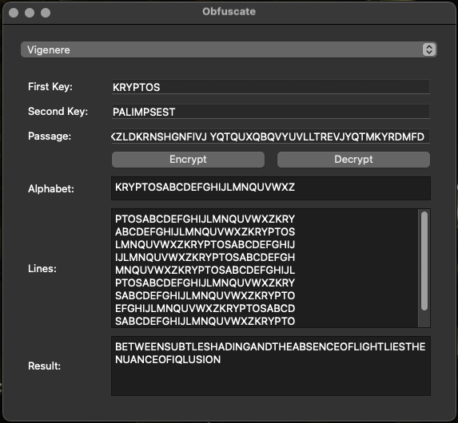
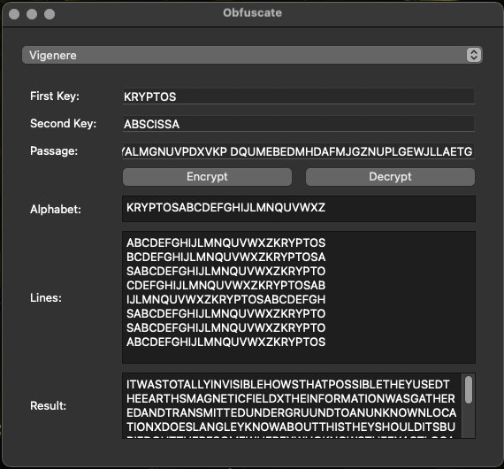

# Obfuscate

This application replicates
- Vigenère cipher used in the famous [Kryptos Sculpture](https://mathweb.ucsd.edu/~crypto/Projects/KarlWang/index.html). Users can input two keys and the desired passage to encrypt or decrypt text.
- Enigma: User can set the setting and decrypt/encrypt desired text.
More encryption methods will be added in the future.

## Installation

1. **Clone the Repository**

   To get started, clone this repository to your local machine using the following command:

```bash
git clone https://github.com/tranhlok/obfuscate.git
cd obfuscate
```
2. **Set Up a Virtual Environment** (optional but recommended)

Create a new virtual environment by running

```bash
python3 -m venv venv
```

Activate the virtual environment:
- On Windows:
  ```bash
  .\venv\Scripts\activate
  ```
- On macOS and Linux:
  ```bash
  source venv/bin/activate
  ```


3. **Install Dependencies**

Install the required Python packages with pip:

```bash
pip install -r requirements.txt
```

## Using the Application
### Run the application:
```bash
python run.py
```
### Using the GUI
Select the encryption technique from the dropdown menu. 

If Vigenère is Selected:

- Enter the first key (a keyword) in the "First Key" field.
- Enter the second key (a keyword) in the "Second Key" field.
- Enter the passage you want to encrypt or decrypt in the "Passage" field.
- Click "Encrypt" to encrypt the passage or "Decrypt" to decrypt the passage.
- The results will be displayed in the "Result" field, along with the generated alphabet and lines used for the Vigenere cipher. All output can be select and copy.

If Enigma is Selected:
- Enter the settings and passage.
- The encrypt/decrypt is the same due to the natural of the machine
## Resources
- The project is inspired by a [Youtube video by LEMMiNO](https://youtu.be/jVpsLMCIB0Y?si=ZF-hhTSyXFATFKFZ)
- [UCSD Solutions walkthrough for KRYPTOS K1-2-3](https://mathweb.ucsd.edu/~crypto/Projects/KarlWang/index2.html)
- This explaination of [Enigma Machine](https://www.101computing.net/enigma-encoder/)
## Test Run for Vigenère

### Kryptos K1
- Keywords: KRYPTOS and PALIMPSEST

- Encrypted Text
```
EMUFPHZLRFAXYUSDJKZLDKRNSHGNFIVJ
YQTQUXQBQVYUVLLTREVJYQTMKYRDMFD
```

- Decrypted Text
```
BETWEENSUBTLESHADINGANDTHEABSENCEOFLIGHTLIESTHENUANCEOFIQLUSION
```
- Decrypted Text  With Spaces
```
BETWEEN SUBTLE SHADING AND THE ABSENCE OF LIGHT LIES THE NUANCE OF IQLUSION
```


### Kryptos K2
- Keywords: KRYPTOS and ABSCISSA

- Encrypted Text
```
VFPJUDEEHZWETZYVGWHKKQETGFQJNCE
GGWHKK?DQMCPFQZDQMMIAGPFXHQRLG
TIMVMZJANQLVKQEDAGDVFRPJUNGEUNA
QZGZLECGYUXUEENJTBJLBQCRTBJDFHRR
YIZETKZEMVDUFKSJHKFWHKUWQLSZFTI
HHDDDUVH?DWKBFUFPWNTDFIYCUQZERE
EVLDKFEZMOQQJLTTUGSYQPFEUNLAVIDX
FLGGTEZ?FKZBSFDQVGOGIPUFXHHDRKF
FHQNTGPUAECNUVPDJMQCLQUMUNEDFQ
ELZZVRRGKFFVOEEXBDMVPNFQXEZLGRE
DNQFMPNZGLFLPMRJQYALMGNUVPDXVKP
DQUMEBEDMHDAFMJGZNUPLGEWJLLAETG
```

- Decrypted Text
```
ITWASTOTALLYINVISIBLEHOWSTHATPOSSIBLETHEYUSEDTHEEARTHSMAGNETICFIELDXTHE 
INFORMATIONWASGATHEREDANDTRANSMITTEDUNDERGRUUNDTOANUNKNOWNLOCATIONXDOES
LANGLEYKNOWABOUTTHISTHEYSHOULDITSBURIEDOUTTHERESOMEWHEREXWHOKNOWSTHEEXACT
LOCATIONONLYWWTHISWASHISLASTMESSAGEXTHIRTYEIGHTDEGREESFIFTYSEVENMINUTES
SIXPOINTFIVESECONDSNORTHSEVENTYSEVENDEGREESEIGHTMINUTESFORTYFOURSECONDSWEST
IDBYROWS
```
- Decrypted Text  With Spaces and Symbols
```
IT WAS TOTALLY INVISIBLE HOW'S THAT POSSIBLE?
THEY USED THE EARTH'S MAGNETIC FIELD. THE INFORMATION WAS GATHERED AND TRANSMITTED UNDERGROUND TO AN UNKNOWN LOCATION.
DOES LANGLEY KNOW ABOUT THIS? THEY SHOULD. IT'S BURIED OUT THERE SOMEWHERE. WHO KNOWS THE EXACT LOCATION? ONLY W.W. THIS WAS HIS LAST MESSAGE:
THIRTY-EIGHT DEGREES FIFTY-SEVEN MINUTES SIX POINT FIVE SECONDS NORTH, SEVENTY-SEVEN DEGREES EIGHT MINUTES FORTY-FOUR SECONDS WEST. ID BY ROWS.
```



## Test Run for Enigma
```
rotors = ("I","II","III")
reflector = "UKW-B"
ringSettings ="ABC"
ringPositions = "DEF" 
plugboard = "AT BS DE FM IR KN LZ OW PV XY"
```
- Encrypted Text
```
DRTLLAANCZJLGZMICXSYRBNTNLLYGOXEABJPZHPOBLWMYJOWDCVHXYWRBAHGLWPUHKYQEVZVNNP```
```
- Decrypted Text
```
UNDERNEATHTHESURFACEHIDDENTRUTHSLINGERAWAITINGTHOSEBRAVEENOUGHTOUNCOVERTHEM
```
- Decrypted Text  With Spaces
```
UNDERNEATH THE SURFACE HIDDEN TRUTHS LINGER AWAITING THOSE BRAVE ENOUGH TO UNCOVER THEM
```


## Folder Structure
```
vigenere_cipher_app/
├── encryption_methods/        # Directory containing different encryption method modules
│   ├── __init__.py           
│   ├── vigenere/              # Directory for the Vigenere cipher implementation
│   │   ├── __init__.py        
│   │   ├── vigenere.py        # Vigenere cipher logic (encryption, decryption, and helpers)
│   └── another_encryption/    # Placeholder for another encryption method
│       ├── __init__.py       
│       ├── another_encryption.py # Logic for another encryption method
├── app/                       # Directory for the main application code
│   ├── __init__.py            
│   ├── main.py                # Main entry point for the PyQt5 application
├── resources/                 # Directory for additional resources (configurations, utilities, etc.)
│   └── __init__.py            
├── README.md                  # Documentation for the project
├── requirements.txt           # Lists all Python dependencies
└── run.py                     # Script to run the application
```

```

 (                                     
 )\ )             *   )                
(()/(           ` )  /((      )        
 /(_)) (    (    ( )(_))(  ( /(  (     
(_))   )\   )\  (_(_()|()\ )(_)) )\ )  
| |   ((_) ((_) |_   _|((_|(_)_ _(_/(  
| |__/ _ \/ _|    | | | '_/ _` | ' \)) 
|____\___/\__|    |_| |_| \__,_|_||_|  
                                       
                                                                                                                                                         
```